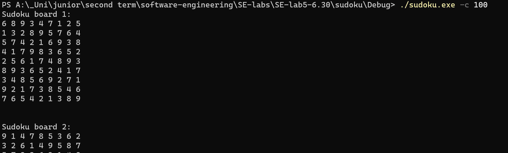
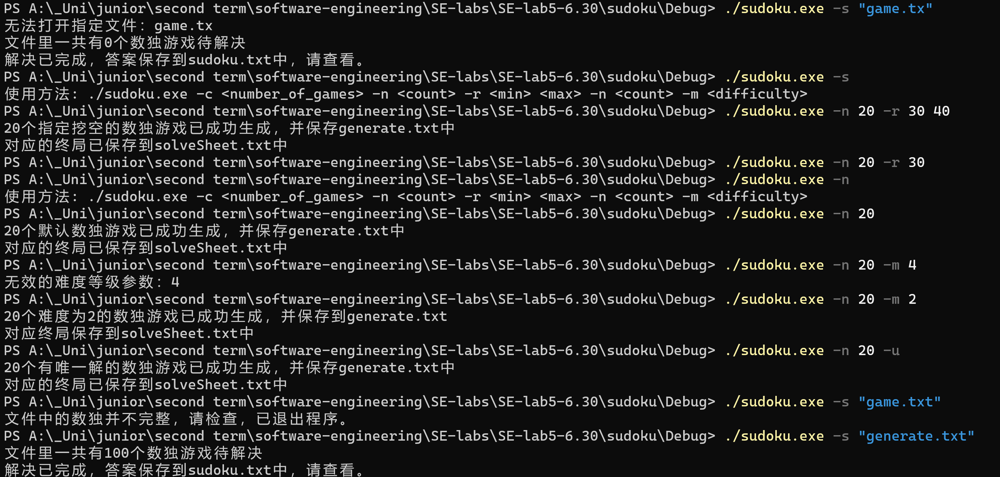
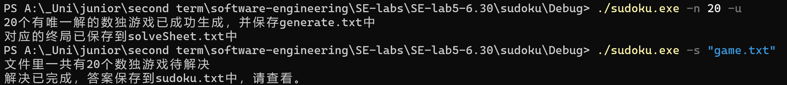
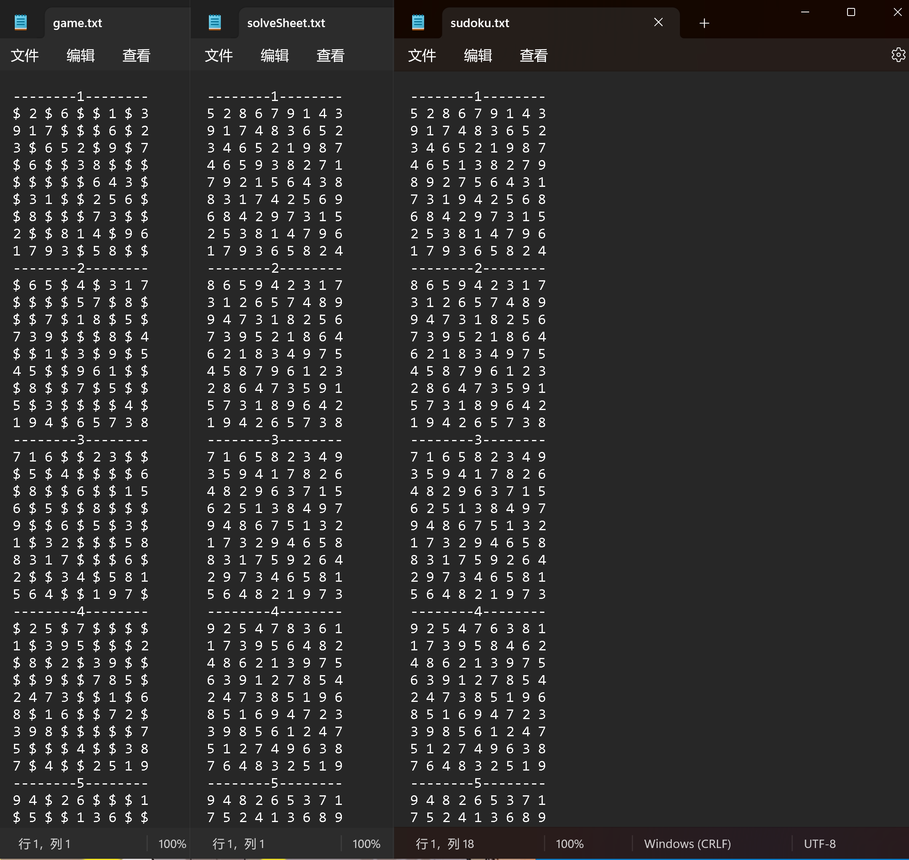
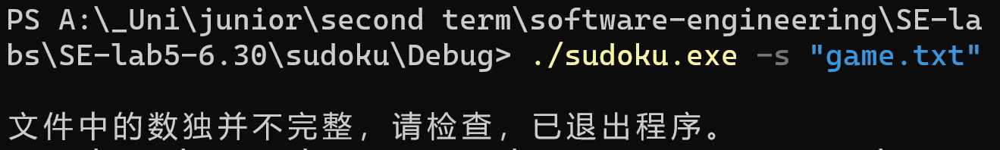
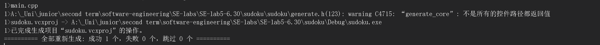

# 软件工程-结对编程作业

## 一、实验要求

### 作业详情

实现一个能够生成数独游戏并求解数独问题的控制台程序，具体包括：
1. 生成不重复的数独终局至文件
2. 读取文件内的数独文件，求解并将结果输出至文件

### 任务要求
1. 采用c++语言实现
2. 可以使用.Net Framework
3. 运行环境为64-bit Windows 10
4. 代码经过质量分析并且消除警告
5. 写出至少10个测试用例来覆盖主要功能，统计覆盖率
6. 使用GitHub来管理源代码和测试用例，根据正常进度及时提交commit
7. 生成数独：shudu.exe -c 100
8. 求解数独：shudu.exe -s path_of_file
9. 空格用$表示

### 参数列表

| 参数名字 | 参数意义                       | 范围限制           | 示例                                                         |
| -------- | ------------------------------ | ------------------ | ------------------------------------------------------------ |
| -c       | 需要的数独终盘数量             | 1-1,000,000        | `sudoku.exe -c 100` 生成100个数独终盘                        |
| -s       | 读取数独游戏文件的路径并给出解 | 绝对路径或相对路径 | `sudoku.exe -s game.txt`从game.txt读取文件，并给出解，把解保存到sudoku.txt中 |
| -n       | 需要的游戏数量                 | 1-10,000           | `sudoku.exe -n 20` 生成20个                                  |
| -m       | 生成游戏的难度                 | 1-3                | `sudoku.exe -n 1000 -m 1`表示生成最简单的1000个游戏，m必须与n同时使用，否则报错 |
| -r       | 生成游戏中挖空的数量范围       | 20-55              | `sudoku.exe -n 20 -r 20~55`表示生成20个挖空数在20-55之间的数独游戏，只有r和n一起使用才可以，否则报错 |
| -u       | 生成游戏的解唯一               |                    | `sudoku.exe -n 20 -u`表示生成20个解唯一的数独游戏，-u和-n一起使用时才不报错 |

### 提交要求

1. 项目源代码（包含测试用例）的GitHub链接
2. 可执行文件
3. 简易用户手册、质量分析截图和测试覆盖率截图
4. 截止时间：6/30 12:00 A.M.

## 二、实验过程

### （一）实验步骤

1. 设计数独游戏的数据结构，如使用二维数组存储数独的格子，使用枚举类型表示格子的状态（空白、已填、不可修改等）。
2. 编写数独游戏的逻辑函数，如生成数独题目、检查用户输入的合法性、判断游戏是否结束等。
3. 编写数独游戏的界面函数，如使用cout和cin实现console的输入输出，使用颜色和符号区分不同状态的格子，使用菜单和指令让用户选择操作等。
4. 将逻辑函数和界面函数组合起来，形成一个完整的数独游戏程序。
5. 使用测试用例和调试工具检查程序的正确性和稳定性，修复可能存在的错误和漏洞。
6. 使用代码规范和注释提高程序的可读性和可维护性，优化程序的性能和效率。

### （二）结对编程

- 分配角色：一人负责编写代码，另一人负责检查代码和提出建议，每隔一段时间交换角色。
- 沟通协作：及时沟通需求和设计，保持代码风格和命名规范的一致性，使用版本控制工具管理代码的修改和更新。
- 互相学习：分享彼此的知识和经验，学习对方的优点和技巧，相互鼓励和支持。

## 三、用户手册

### （一）项目结构

``` bash
│--README.md     
└--example
   │--game.txt      // 用于对-s进行测试的数独游戏文件
   │--solveSheet.txt// 使用-n生成游戏时对应的终局文件，每次使用-n前都要删除
   │--generate.txt  // 使用-n生成的数独游戏文件，每次使用-n生成游戏前都要删除该文件
   │--sudoku.txt    // 使用-s生成的解决数独得到的答案，每次使用-s前都要删除
└--src              // 源代码目录  
   │--main.cpp      // 入口文件  
   │--generate.h    // 生成数独游戏文件
   │--solver.h      // 解决数独问题文件
```

### （二）控制台命令





### （三）使用截图

使用`sudoku -n 20 -u`生成有唯一解的数独游戏；随后使用`sudoku -s "game.txt"`进行求解，可以看到程序能够顺利解开测试用的数独游戏，并且与对应的答案相同。



如下图所示，文件含义在项目结构中提供：



如果将`game.txt`中的数独删去一些数据，则可以看到程序反馈：



## 四、质量测试

``` bash
C:\Program Files (x86)\Microsoft Visual Studio\2019\Community\VC\Tools\MSVC\14.29.30133\include\ostream(284): warning C4530: 使用了 C++ 异常处理程序，但未启用展开语义。请指定 /EHsc
C:\Program Files (x86)\Microsoft Visual Studio\2019\Community\VC\Tools\MSVC\14.29.30133\include\ostream(269): note: 在编译 类 模板 成员函数“std::basic_ostream<char,std::char_traits<char>> &std::basic_ostream<char,std::char_traits<char>>::operator <<(int)”时
A:\_Uni\junior\second term\software-engineering\SE-labs\SE-lab5-6.30\sudoku\sudoku\generate.h(31): note: 查看对正在编译的函数模板实例化“std::basic_ostream<char,std::char_traits<char>> &std::basic_ostream<char,std::char_traits<char>>::operator <<(int)”的引用
A:\_Uni\junior\second term\software-engineering\SE-labs\SE-lab5-6.30\sudoku\sudoku\generate.h(28): note: 查看对正在编译的类模板实例化“std::basic_ostream<char,std::char_traits<char>>”的引用
A:\_Uni\junior\second term\software-engineering\SE-labs\SE-lab5-6.30\sudoku\sudoku\main.cpp(28) : warning C6246: “eraseCount”的局部声明遮蔽了外部作用域中具有相同名称的声明。有关其他信息，请参见此前位于“19”行(“a:\_uni\junior\second term\software-engineering\se-labs\se-lab5-6.30\sudoku\sudoku\main.cpp”中)的声明。: Lines: 19
A:\_Uni\junior\second term\software-engineering\SE-labs\SE-lab5-6.30\sudoku\sudoku\main.cpp(39) : warning C6246: “eraseCount”的局部声明遮蔽了外部作用域中具有相同名称的声明。有关其他信息，请参见此前位于“19”行(“a:\_uni\junior\second term\software-engineering\se-labs\se-lab5-6.30\sudoku\sudoku\main.cpp”中)的声明。: Lines: 19
A:\_Uni\junior\second term\software-engineering\SE-labs\SE-lab5-6.30\sudoku\sudoku\generate.h(123) : warning C4715: “generate_core”: 不是所有的控件路径都返回值
```


